<h1 align="center">Zaid Sabbagh · Client Work Showcase</h1>

  Full-stack web developer building bilingual (Arabic / English) websites and online stores for businesses in Saudi Arabia and Jordan.
   
  Every project below was designed into code, built, and deployed by me, end to end.

  <a href="https://www.linkedin.com/in/zaid-sabbagh-6a7287227/">LinkedIn</a> ·
  <a href="mailto:sabbaghzaid88@gmail.com">sabbaghzaid88@gmail.com</a> ·
  <a href="https://professional-portfolio-v2-dis2.vercel.app">Portfolio</a> ·
  <a href="https://github.com/mercenary19961">GitHub</a>

---

The source code for these projects is private, because it belongs to my clients. This repository shows what each one is, how it was built at a high level, and where to see it live. I am happy to walk through the code and architecture in an interview.

| Project | What it is | Live |
|---|---|---|
| [Retab Stores](#retab-stores) | E-commerce store for premium Saudi dates | [retab.com.sa](https://retab.com.sa) |
| [Sky Amman](#sky-amman) | Real estate development company website with CMS | [skyamman.com](https://www.skyamman.com) |
| [Nuor Steel](#nuor-steel) | Corporate website for a Saudi steel manufacturer | [nuorsteel-website-production.up.railway.app](https://nuorsteel-website-production.up.railway.app) |
| [HardRock](#hardrock) | Digital marketing agency website | Archived, [watch the walkthrough](#hardrock) |

**Shared stack:** Laravel 12 · Inertia.js · React · TypeScript · Tailwind CSS · MySQL · deployed on Railway behind Cloudflare, with server-side rendering for SEO.

---

## Retab Stores

**Online store for a Saudi dates brand, rebuilt from a hosted SaaS platform into a custom system the client owns.**
Arabic first, with a full English version, serving customers across Saudi Arabia.

🔗 **Live:** [retab.com.sa](https://retab.com.sa) · 📅 2026

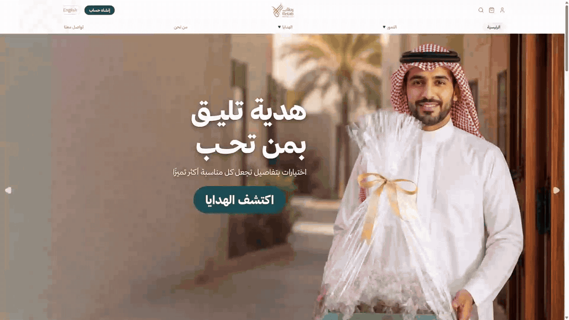

  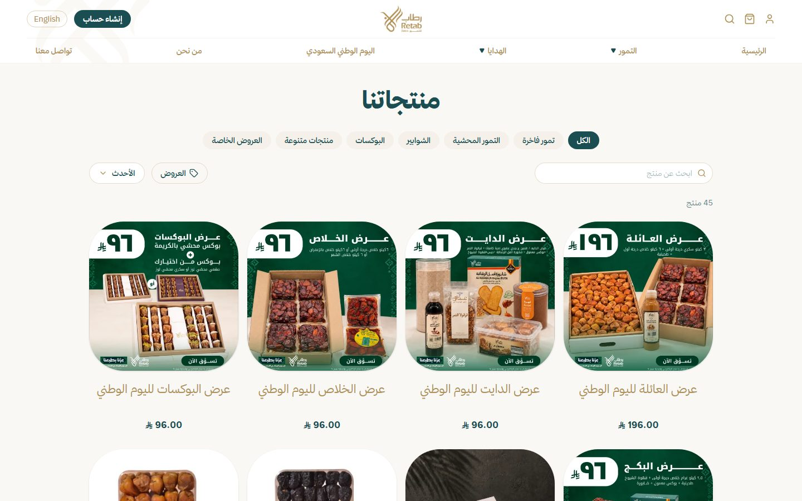
  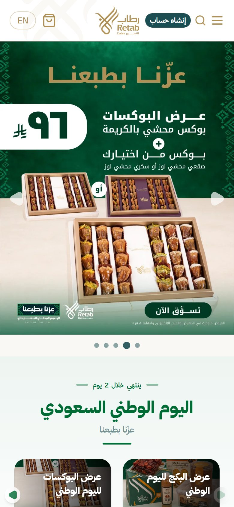

https://github.com/user-attachments/assets/7e5c5bfc-7f1a-47ef-b50c-c26b0058b315

**Highlights**
- Arabic-first storefront (right to left) with an instant switch to English
- Checkout with card payments (mada, Visa, Mastercard, Apple Pay), buy now pay later through Tamara, and bank transfer
- Shipping through the OTO aggregator, with an admin page to compare carriers and choose which ones the store uses
- Back office for orders, returns, coupons, a loyalty programme, timed campaigns and homepage banners
- Order and marketing notifications over the WhatsApp Cloud API and email
- Staff roles with per-section permissions, and a change log that can undo edits safely
- Automatic image optimisation (WebP in three sizes) served from Cloudflare R2
- Automated tests on every push, including browser tests of the full checkout

`Laravel 12` `Inertia.js 3` `React 19` `TypeScript` `Tailwind CSS 4` `MySQL` `Cloudflare R2` `Playwright`

---

## Sky Amman

**Company website for a real estate developer in Amman, with an admin panel the team uses to manage every page.**

🔗 **Live:** [skyamman.com](https://www.skyamman.com) · 📅 2026

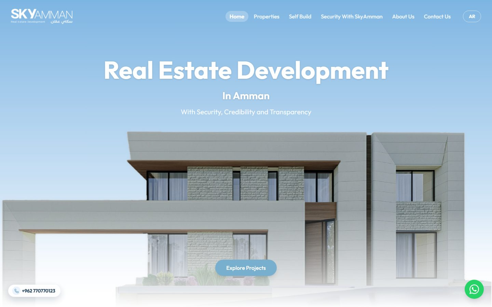

  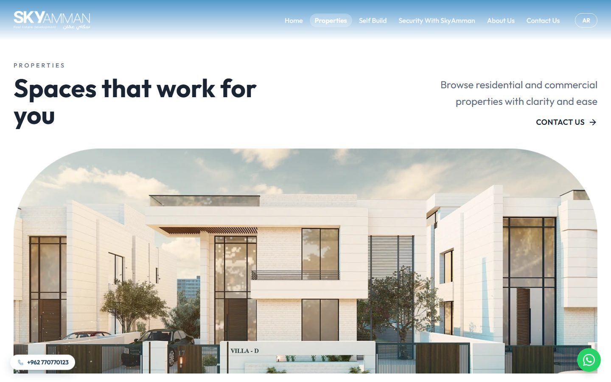
  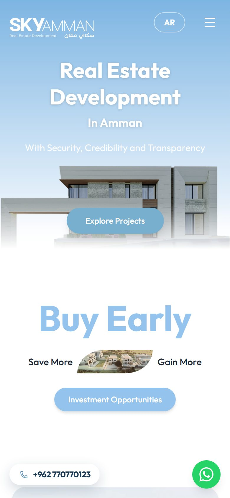

https://github.com/user-attachments/assets/75e43ce8-c5ad-4714-8ade-fe653a489ad0

**Highlights**
- Property listings with category filters and detail pages that feed straight into enquiries
- Bilingual English and Arabic site with a manual language switch
- Content management for every page, with a change history and undo
- One inbox for every lead form, linked to the property it came from
- Bot protection with Cloudflare Turnstile, rate limiting and security headers
- Server-side rendering so pages are fully indexable and share cleanly on social media

`Laravel 12` `Inertia.js 3` `React 19` `TypeScript` `Tailwind CSS 4` `Framer Motion` `MySQL`

---

## Nuor Steel

**Corporate website for a Saudi manufacturer of steel rebar and billets.**

🔗 **Live:** [nuorsteel-website-production.up.railway.app](https://nuorsteel-website-production.up.railway.app) · 📅 2026

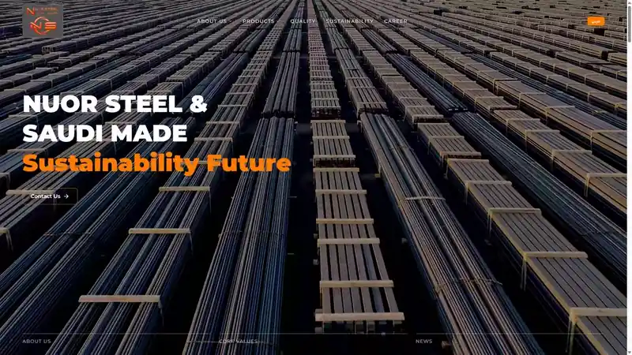

  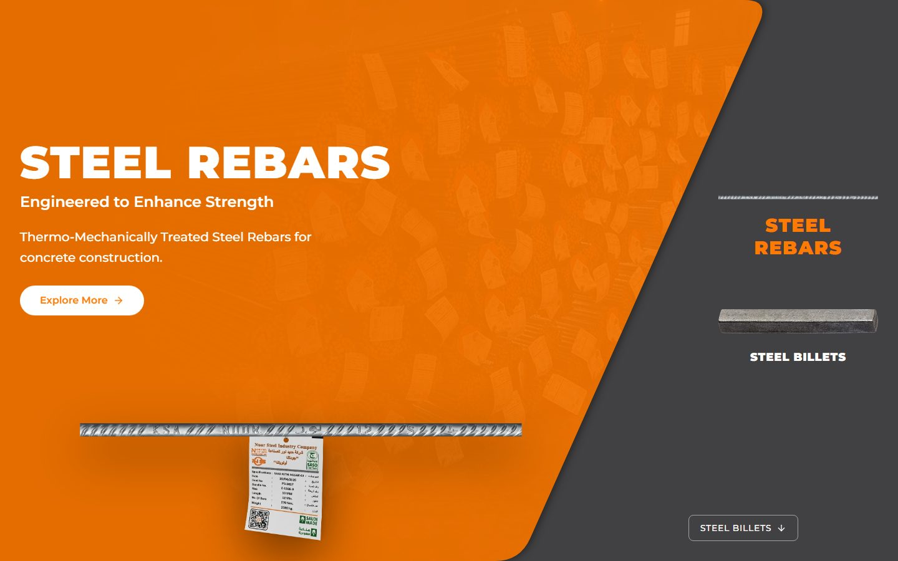
  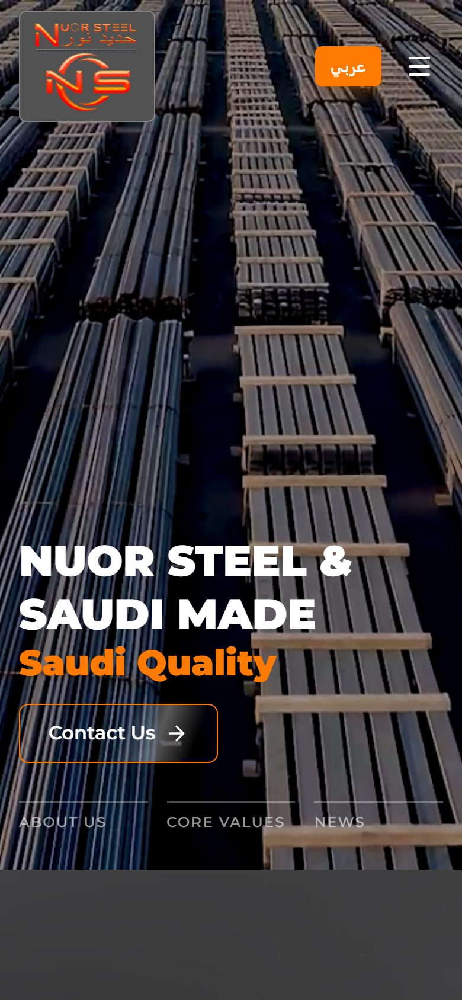

https://github.com/user-attachments/assets/b70fcde4-66e1-4b36-9c56-05ef52ed5915

**Highlights**
- Product pages for rebar and billets with downloadable specification sheets
- Quality and certificates library with an in-page PDF viewer
- Careers section with job listings and online applications with CV upload
- Bilingual Arabic and English, with animated, scroll-driven sections
- Admin panel for content, products, certificates, jobs, applications and the media library
- Error monitoring with Sentry and cloud file storage

`Laravel 12` `Inertia.js` `React 19` `TypeScript` `Tailwind CSS 4` `Framer Motion` `MySQL`

---

## HardRock

**Website for a digital marketing and AI solutions agency in Jordan.**

🗄️ **Archived:** the company has closed and the site is no longer online · 📅 2026

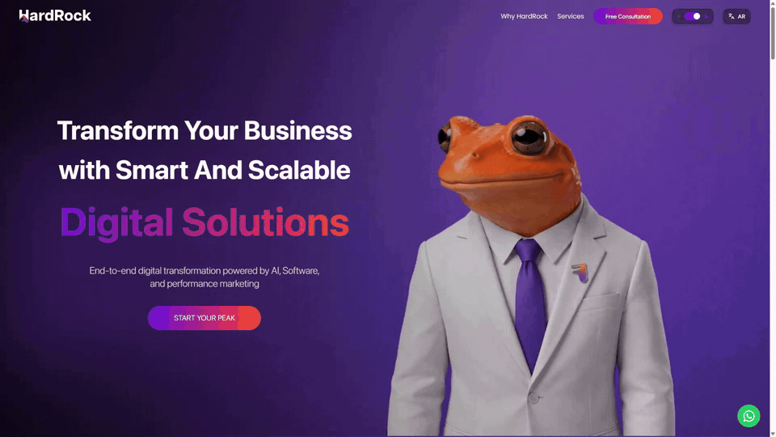

  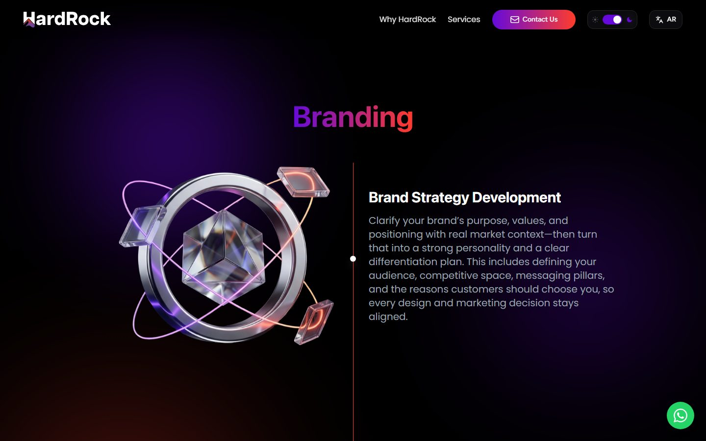
  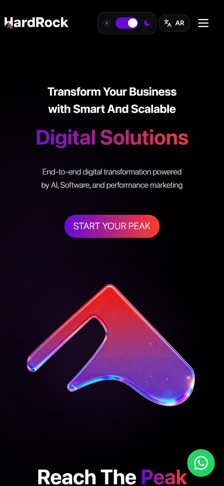

🎬 **Walkthrough of the live site**, recorded before it went offline: the animated hero, the service sections with their 3D visuals, the Software & AI page, and the full Arabic version.

https://github.com/user-attachments/assets/2ba23fc2-6814-427d-ab58-c0cb38981a5d

**Highlights**
- Animated landing page with a character that follows the cursor
- Service pages with 3D visuals and motion design
- Light and dark themes, in English and Arabic
- Lead capture form and an admin panel to manage submissions and team members
- Cookie consent built in house with Google Consent Mode v2
- Technical SEO: server-side rendering, structured data and sitemaps

`Laravel 12` `Inertia.js` `React` `TypeScript` `Tailwind CSS` `Framer Motion` `MySQL`

---

  Screenshots, logos and brand assets belong to their respective owners and are shown here as examples of my work.

